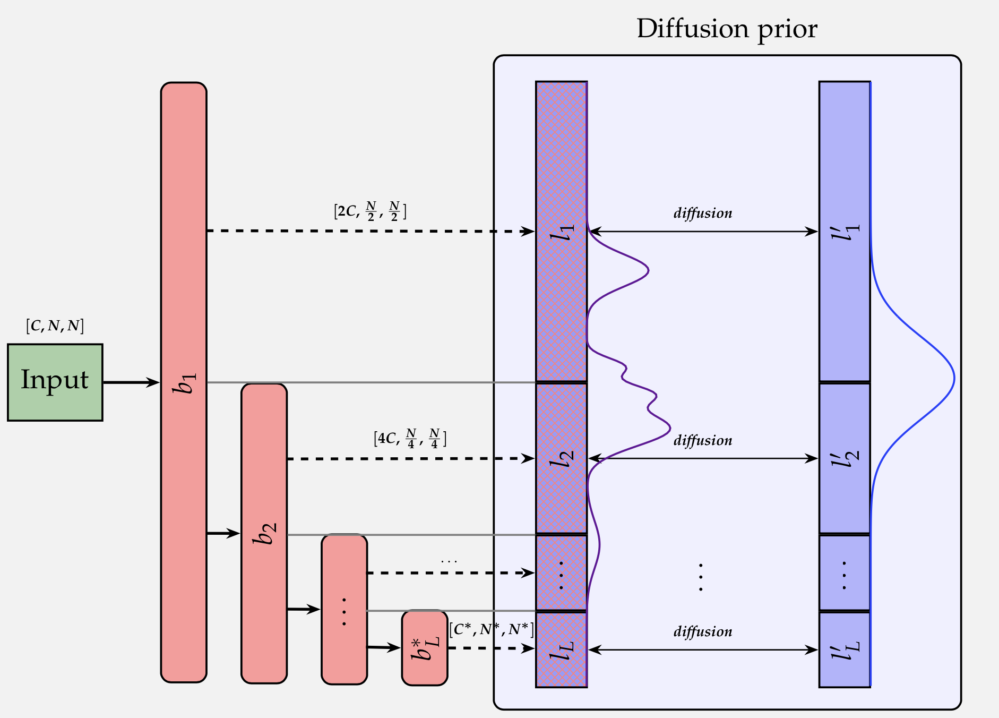
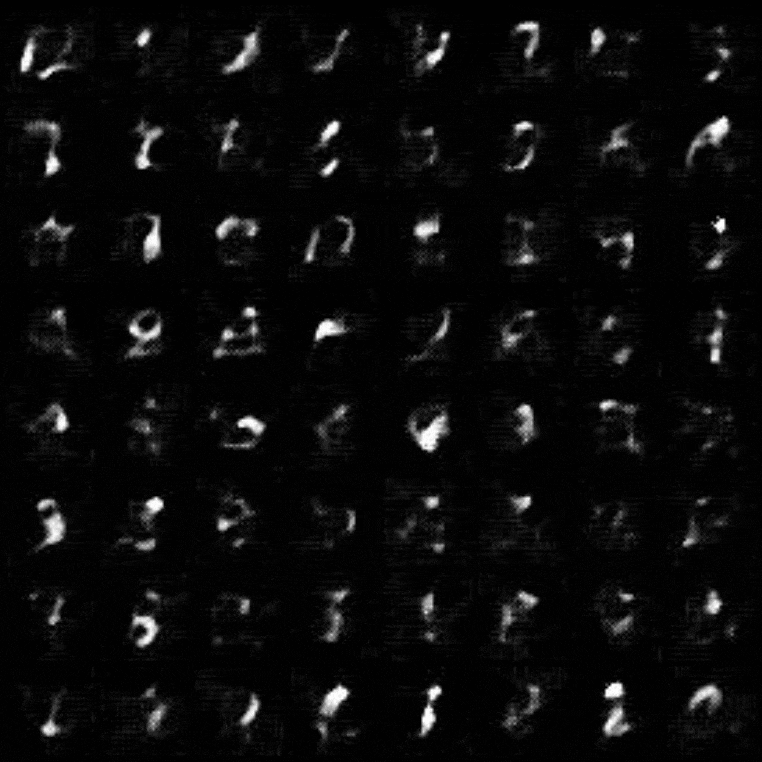

# Normalizing Flow with Diffusion Prior Model (NFDPM)

<p align="center">
    
</p>

Welcome to the repository for my Master's thesis project at Technical University of Munich (TUM), titled "Diffusion Models as Latent Priors in Generative Models ". This project aims to explore the use of Normalizing Flows and Diffusion Probabilistic Models for efficient and accurate data sampling, which is a crucial task in many machine learning applications. The Normalizing Flow with Diffusion Prior Model (NFDPM) combines the strengths of both models and offers promising results for high-dimensional data synthesis. This repository contains the implementation of the NFDPM along with the experimental results and evaluations on various benchmark datasets. Access my Master's thesis [here](https://drive.google.com/file/d/1aB2blhGClNXGCDlN7wZvG8Nw4Wqr3lNt/view?usp=sharing). Feedback is always welcome!





***

### How to run

1) Create a virtual environment and install the requirements:
    ```console
    conda create -n env_diff_prior python=3.8
    conda activate env_diff_prior
    
    conda install pytorch torchvision pytorch-cuda=11.6 -c pytorch -c nvidia
    pip install -r requirements.txt
    ```

2) Download the datasets by running `./data/get_datasets.sh` bash script.


3) Precompute statistics for FID and KID evaluation:
    ```console
    python metrics/precompute_stats.py --action=precompute --data_root=<path-to-datasets-folder>
    ```

***

### Experiments

<details>
  <summary>Run a baseline Normalizing Flow experiment on MNIST</summary>

```console
python run_baseline_experiment.py \
    hydra.job.chdir=True \
    phase=train \
    seed=42 \
    experiment_name=1_MNIST_base_42_L3_K4 \
    data.name=MNIST \
    data.root=<path-to-datasets-folder> \
    data.batch_size=64 \
    data.num_workers=0 \
    data.img_size=32 \
    data.transformations='[]' \
    model.architecture.L=3 \
    model.architecture.K=4 \
    model.training.epochs=1000 \
    model.training.print_freq=20 \
    model.training.save_checkpoint_freq=500 \
    model.training.n_bits=5 \
    model.training.temperature=0.7 \
    model.optimizer.type=adam \
    model.optimizer.lr=1e-4 \
    model.logging.log_gen_images_per_iter=20
```
</details>

<details>
  <summary>Run a baseline Normalizing Flow experiment on CIFAR-10</summary>

```console
python run_baseline_experiment.py \
    hydra.job.chdir=True \
    data.name=cifar10 \
    data.root=<path-to-datasets-folder> \
    experiment_name=2_CIFAR10_base_42_L3_K16 \
    seed=42 \
    phase=train \
    data.batch_size=128 \
    data.num_workers=0 \
    data.img_size=32 \
    data.transformations='["RandomHorizontalFlip"]' \
    model.architecture.L=3 \
    model.architecture.K=16 \
    model.training.epochs=1000 \
    model.training.print_freq=20 \
    model.training.save_checkpoint_freq=500 \
    model.training.n_bits=5 \
    model.training.temperature=0.7 \
    model.optimizer.type=adam \
    model.optimizer.lr=1e-4 \
    model.logging.log_gen_images_per_iter=10 \
    model.evaluation.metrics.FID.mode='["legacy_tensorflow"]' \
    model.evaluation.metrics.FID.model_name='["inception_v3"]'
```
</details>

<details>
  <summary>Run a baseline Normalizing Flow experiment on ImageNet32</summary>

```console
python run_baseline_experiment.py \
    hydra.job.chdir=True \
    data.name=imagenet32 \
    data.root=<path-to-datasets-folder> \
    experiment_name=3_imagenet32_base_42_L3_K16 \
    seed=42 \
    phase=train \
    data.batch_size=128 \
    data.num_workers=0 \
    data.img_size=32 \
    data.transformations='[]' \
    model.architecture.L=3 \
    model.architecture.K=16 \
    model.training.epochs=40 \
    model.training.print_freq=20 \
    model.training.save_checkpoint_freq=40 \
    model.training.n_bits=5 \
    model.training.temperature=0.7 \
    model.optimizer.type=adam \
    model.optimizer.lr=1e-4 \
    model.logging.log_gen_images_per_iter=400 \
    model.evaluation.metrics.FID.mode='["legacy_tensorflow","clean"]' \
    model.evaluation.metrics.FID.model_name='["inception_v3","inception_v3"]' \
    model.evaluation.metrics.KID.mode='["legacy_tensorflow","clean"]' \
    model.evaluation.metrics.KID.model_name='["inception_v3","inception_v3"]'
```
</details>


<details>
  <summary>Run a baseline Normalizing Flow experiment on CelebA</summary>

```console
python run_baseline_experiment.py \
    hydra.job.chdir=True \
    data.name=celeba \
    data.root=<path-to-datasets-folder> \
    experiment_name=4_celeba_base_42_L5_K16 \
    seed=42 \
    phase=train \
    data.batch_size=8 \
    data.num_workers=0 \
    data.img_size=128 \
    data.transformations='[]' \
    model.architecture.L=5 \
    model.architecture.K=16 \
    model.training.epochs=10 \
    model.training.print_freq=20 \
    model.training.save_checkpoint_freq=10 \
    model.training.n_bits=5 \
    model.training.temperature=0.7 \
    model.optimizer.type=adam \
    model.optimizer.lr=1e-4 \
    model.logging.log_gen_images_per_iter=1000 \
    model.evaluation.metrics.FID.mode='["legacy_tensorflow","clean","legacy_tensorflow","clean"]' \
    model.evaluation.metrics.FID.model_name='["inception_v3","inception_v3","clip_vit_b_32","clip_vit_b_32"]' \
    model.evaluation.metrics.KID.mode='["legacy_tensorflow","clean","legacy_tensorflow","clean"]' \
    model.evaluation.metrics.KID.model_name='["inception_v3","inception_v3","clip_vit_b_32","clip_vit_b_32"]'
```
</details>


<details>
  <summary>Run a Diffusion prior experiment on MNIST</summary>

```console
python run_diffusion_prior_experiment.py \
    hydra.job.chdir=True \
    data.name=MNIST \
    data.root=<path-to-datasets-folder> \
    experiment_name=5_MNIST_diff_42_L3_K4_frozen_identity \
    seed=42 \
    phase=train \
    data.batch_size=128 \
    data.num_workers=0 \
    data.img_size=32 \
    data.transformations='[]' \
    model.normalizing_flow.init_nf.mode=pretrain \
    model.normalizing_flow.init_nf.pretrain.dir=1_MNIST_base_42_L3_K4 \
    model.normalizing_flow.init_nf.pretrain.epoch=1000 \
    model.normalizing_flow.freeze=True \
    model.normalizing_flow.lr=1e-7 \
    model.normalizing_flow.latent_formater=IdentityFormater \
    model.unet.dim=64 \
    model.unet.dim_mults='[1, 2]' \
    model.unet.resnet_block_groups=8 \
    model.unet.learned_sinusoidal_cond=False \
    model.unet.random_fourier_features=False \
    model.unet.learned_sinusoidal_dim=16 \
    model.diffusion.timesteps=1000 \
    model.diffusion.sampling_timesteps=1000 \
    model.diffusion.loss_type=l2 \
    model.diffusion.beta_schedule=cosine \
    model.diffusion.ddim_sampling_eta=1.0 \
    model.training.epochs=300 \
    model.training.print_freq=40 \
    model.training.save_checkpoint_freq=100 \
    model.training.n_bits=5 \
    model.training.temperature=1.0 \
    model.logging.log_gen_images_per_iter=10 \
    model.logging.log_param_distribution=False \
    model.optimizer.lr=1e-5
```
</details>

<details>
  <summary>Run a Diffusion prior experiment on CIFAR-10</summary>

```console
python run_diffusion_prior_experiment.py \
    hydra.job.chdir=True \
    data.name=cifar10 \
    data.root=<path-to-datasets-folder> \
    experiment_name=6_CIFAR10_diff_42_L3_K16_frozen_identity \
    seed=42 \
    phase=train \
    data.batch_size=128 \
    data.num_workers=0 \
    data.img_size=32 \
    data.transformations='["RandomHorizontalFlip"]' \
    model.normalizing_flow.init_nf.mode=pretrain \
    model.normalizing_flow.init_nf.pretrain.dir=2_CIFAR10_base_42_L3_K16 \
    model.normalizing_flow.init_nf.pretrain.epoch=1000 \
    model.normalizing_flow.freeze=True \
    model.normalizing_flow.lr=1e-4 \
    model.normalizing_flow.latent_formater=IdentityFormater \
    model.unet.dim=64 \
    model.unet.dim_mults='[1, 2]' \
    model.unet.resnet_block_groups=8 \
    model.unet.learned_sinusoidal_cond=False \
    model.unet.random_fourier_features=False \
    model.unet.learned_sinusoidal_dim=16 \
    model.diffusion.timesteps=1000 \
    model.diffusion.sampling_timesteps=1000 \
    model.diffusion.loss_type=l2 \
    model.diffusion.beta_schedule=cosine \
    model.diffusion.ddim_sampling_eta=1.0 \
    model.training.epochs=300 \
    model.training.print_freq=20 \
    model.training.save_checkpoint_freq=100 \
    model.training.n_bits=5 \
    model.training.temperature=1.0 \
    model.logging.log_param_distribution=False \
    model.optimizer.lr=1e-5 \
    model.logging.log_gen_images_per_iter=10 \
    model.evaluation.metrics.FID.mode='["legacy_tensorflow"]' \
    model.evaluation.metrics.FID.model_name='["inception_v3"]'
```
</details>

<details>
  <summary>Run a Diffusion prior experiment on ImageNet32</summary>

```console
python run_diffusion_prior_experiment.py \
    hydra.job.chdir=True \
    data.name=imagenet32 \
    data.root=<path-to-datasets-folder> \
    experiment_name=7_imagenet32_diff_42_L3_K16_frozen_identity \
    seed=42 \
    phase=train \
    data.batch_size=64 \
    data.num_workers=0 \
    data.img_size=32 \
    data.transformations='[]' \
    model.normalizing_flow.init_nf.mode=pretrain \
    model.normalizing_flow.init_nf.pretrain.dir=3_imagenet32_base_42_L3_K16 \
    model.normalizing_flow.init_nf.pretrain.epoch=40 \
    model.normalizing_flow.freeze=True \
    model.normalizing_flow.lr=1e-4 \
    model.normalizing_flow.latent_formater=IdentityFormater \
    model.unet.dim=64 \
    model.unet.dim_mults='[1, 2]' \
    model.unet.resnet_block_groups=16 \
    model.unet.learned_sinusoidal_cond=False \
    model.unet.random_fourier_features=False \
    model.unet.learned_sinusoidal_dim=16 \
    model.diffusion.timesteps=1000 \
    model.diffusion.sampling_timesteps=1000 \
    model.diffusion.loss_type=l2 \
    model.diffusion.beta_schedule=cosine \
    model.diffusion.ddim_sampling_eta=1.0 \
    model.training.epochs=30 \
    model.training.print_freq=20 \
    model.training.save_checkpoint_freq=30 \
    model.training.n_bits=5 \
    model.training.temperature=1.0 \
    model.logging.log_param_distribution=False \
    model.optimizer.lr=1e-5 \
    model.logging.log_gen_images_per_iter=800 \
    model.evaluation.metrics.FID.mode='["legacy_tensorflow","clean"]' \
    model.evaluation.metrics.FID.model_name='["inception_v3","inception_v3"]' \
    model.evaluation.metrics.KID.mode='["legacy_tensorflow","clean"]' \
    model.evaluation.metrics.KID.model_name='["inception_v3","inception_v3"]'
```
</details>


<details>
  <summary>Run a Diffusion Prior experiment on CelebA</summary>

```console
python run_diffusion_prior_experiment.py \
    hydra.job.chdir=True \
    data.name=celeba \
    data.root=<path-to-datasets-folder> \
    experiment_name=8_celeba_diff_42_L5_K16_frozen_identity \
    seed=42 \
    phase=train \
    data.batch_size=8 \
    data.num_workers=0 \
    data.img_size=128 \
    data.transformations='[]' \
    model.normalizing_flow.init_nf.mode=pretrain \
    model.normalizing_flow.init_nf.pretrain.dir=4_celeba_base_42_L5_K16 \
    model.normalizing_flow.init_nf.pretrain.epoch=10 \
    model.normalizing_flow.freeze=True \
    model.normalizing_flow.lr=1e-4 \
    model.normalizing_flow.latent_formater=IdentityFormater \
    model.unet.dim=64 \
    model.unet.dim_mults='[1, 2, 2]' \
    model.unet.resnet_block_groups=16 \
    model.unet.learned_sinusoidal_cond=False \
    model.unet.random_fourier_features=False \
    model.unet.learned_sinusoidal_dim=16 \
    model.diffusion.timesteps=1000 \
    model.diffusion.sampling_timesteps=1000 \
    model.diffusion.loss_type=l2 \
    model.diffusion.beta_schedule=cosine \
    model.diffusion.ddim_sampling_eta=1.0 \
    model.training.epochs=10 \
    model.training.print_freq=80 \
    model.training.save_checkpoint_freq=10 \
    model.training.n_bits=5 \
    model.training.temperature=1.0 \
    model.logging.log_param_distribution=False \
    model.optimizer.lr=1e-5 \
    model.logging.log_gen_images_per_iter=250 \
    model.evaluation.metrics.FID.mode='["legacy_tensorflow","clean","legacy_tensorflow","clean"]' \
    model.evaluation.metrics.FID.model_name='["inception_v3","inception_v3","clip_vit_b_32","clip_vit_b_32"]' \
    model.evaluation.metrics.KID.mode='["legacy_tensorflow","clean","legacy_tensorflow","clean"]' \
    model.evaluation.metrics.KID.model_name='["inception_v3","inception_v3","clip_vit_b_32","clip_vit_b_32"]'
```
</details>

***

### Monitoring
Launch a dashboard to monitor experiments:
```console
cd ./outputs/nf_experiments/aim
aim up
```


***

### Useful resources
I am deeply grateful for the following open-source repositories which have been instrumental in facilitating my research:
- [UvA DL Notebooks: Normalizing Flows for image modeling](https://uvadlc-notebooks.readthedocs.io/en/latest/tutorial_notebooks/tutorial11/NF_image_modeling.html)
- [Glow-PyTorch](https://github.com/pclucas14/pytorch-glow)
- [Denoising Diffusion Probabilistic Model, in Pytorch](https://github.com/lucidrains/denoising-diffusion-pytorch)


***

### License
Licensed under an MIT license.
